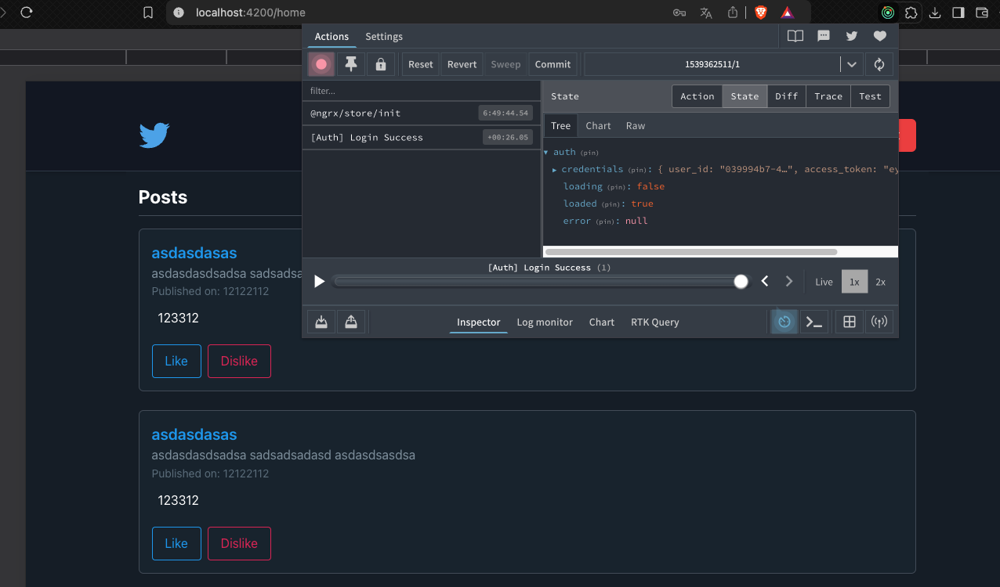

# PEC 2

Sé que se propone un orden de carpetas /auth y meter ahí todo lo de esta pec pero en este proyecto se encuentra todo en /store y los models lo he dejado como estaba.

## EXCELS

Los excels los tienes en este mismo archivo son excel.pdf y excel.xlsx .

## Capturas de pantalla de redux

Utilizo navegador brave y me puse un plugin para ver que estaba todo ok.
